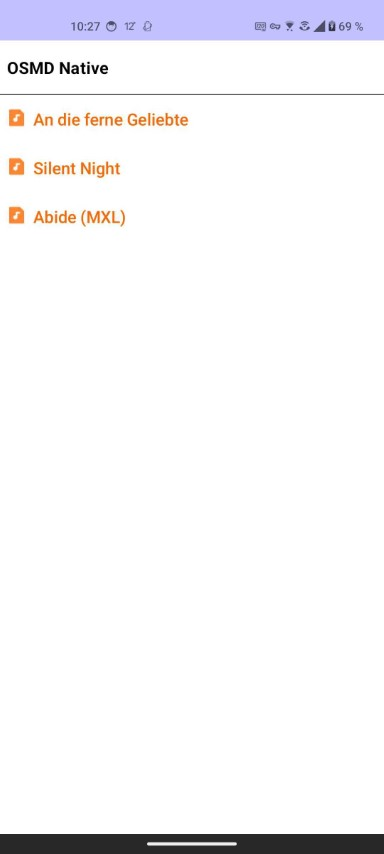
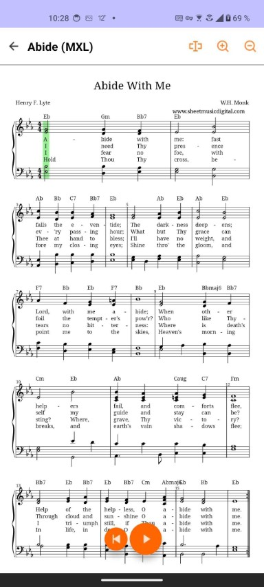
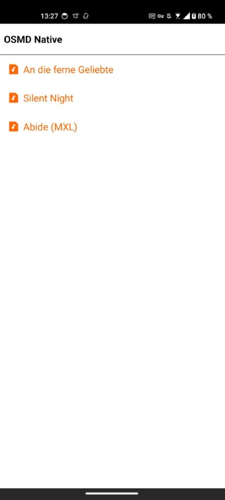
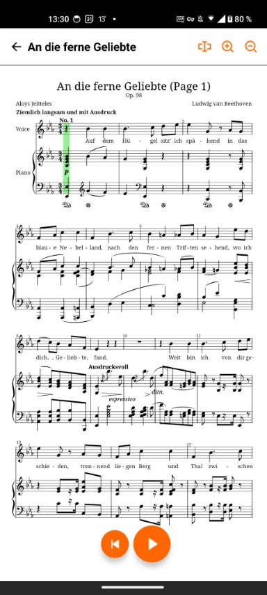

# osmd-native

OpenSheetMusicDisplay for React Native & Kotlin / Compose  
This repo contains sources for two platform libraries:
- [osmd-kotlin](osmd-kotlin/) for the Kotlin / Compose version
- [react-native-osmd](react-native-osmd/) for the React Native version

|  
Kotlin
 |  
Kotlin
 |
|---	|---	|
|  
React Native
 |  
React Native
 |

