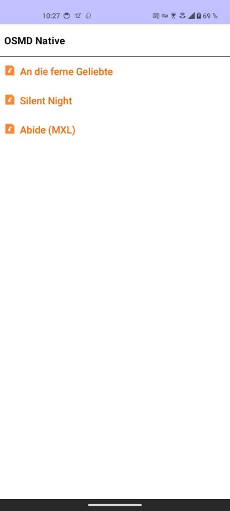

# react-native-osmd

OpenSheetMusicDisplay for Kotlin / Compose
Currently supports:
- setting OSMDOptions via props
- setting a musicXML string or URL via props
- playing audio & controlling playback
- zoom in / out




## Table of contents
* [Installation](#installation)
* [Usage](#usage)
* [Example](#example)
* [Development](#development)
* [Setup](#setup)
* [Structure](#structure)
* [Interface](#interface)
* [Updating OSMD](#updating-osmd)
* [Building & Publishing](#building--publishing)

## Installation

TBD (@TODO kotlin lib publish)

## Usage

Simplest usage rendering a music sheet:
```kotlin
import org.opensheetmusicdisplay.osmd.kotlin.OSMD

// path to a music xml file, either local or remote
val musicXML = "https://appassets.androidplatform.net/assets/AbideWithMe.mxl"

// osmd object controlling playback, zoom & cursor
val osmd = OSMD()

// ... in your composable layout:
Column {
  osmd.OSMDView(musicXML)
}
```

**Note**: for local files, the file path passed via `musicXML` needs to be in the `assets` folder within the main app directory. 

## Examples
See `./app` for an example kotlin app using this library.  
Some usage scenario examples:

#### Controlling audio playback

// video

Audio playback can be controlled via play / pause / stop methods on the `osmd` instance:  

```kotlin
  val osmd = OSMD()
  // ...

  osmd.play()   // start playback
  osmd.pause()  // pause playback at current position
  osmd.stop()   // stop playback and reset to beginning
```
#### Changing cursor color

// video

Cursor color can be set  on the `osmd` instance:
```kotlin
osmd.setCursorColor('#f00')
```

#### Zoom In/Out

// video

Zoom scale gan be set on the `osmd` object (default is `1.0`):
```kotlin
osmd.setZoom(1.1)
```

## Development

### Setup
Make sure your environment is setup for Android Studio & Kotlin w/ Jetpack Compose.
Check https://developer.android.com/develop/ui/compose/setup 


1. Clone the repo
2. Open the project in Android Studio

The project will include both the example `app` and the `osmd-kotlin` lib, which is the source of the `OSMD` class providing functionality for audio playback, zoom, options & the composable `OSMDView` component. You can simply run the example app during development for testing.


### Structure
The project directory has the following structure:
```
[root]                      (root project directory)
 ├─ app           (kotlin example app source) 
 ├─ [/../] osmd-kotlin                   (lib source) 
 ├── assets              (opensheetmusicdisplay.min.js & init scripts/html) 
```
The architecture of this lib can be summarized like this:
- An [OSMD build](https://github.com/opensheetmusicdisplay/opensheetmusicdisplay) is encapsulated inside a skeleton  webview that loads nothing but an empty html page with a single container inside to load OSMD into
- The `InjectionScripts.kt` file contains js that can be passed to and launched inside the webview to load OSMD, set options, load & render a music sheet and control playback within Kotlin. These scripts essentially expose the actual OSMD functionality.

With that setup, the kotlin library is defined via the `OSMD` class -  it exports functions for playback control, cursor & zoom settings and the composable `OSMDView` component which is the main view component that renders a given music xml.

### Interface

#### View Props
```kotlin
/**
 * The composable OSMDView rendering a music sheet.
 *
 * @param musicXML the path to the music sheet file (.xml or .mxl inside assets folder)
 * @param options optional list of OSMD options (see https://github.com/opensheetmusicdisplay/osmd-types-player )
 * @param onRender optional function callback to be after render (i.e., for loading indicators etc.)
 */
 @Composable
 fun OSMDView(musicXML: String, options: JSONObject? = null, onRender: (() -> Unit)? = null)
```
#### Object methods
```kotlin
val osmd = OSMD()
// ...
osmd.play()   // start playback
osmd.pause()  // pause playback at current position
osmd.stop()   // stop playback and reset to beginning
osmd.setCursorColor('#f00') // sets the color of the cursor
osmd.setZoom(1.1) // sets the zoom scale of the rendered sheet
```

### Updating OSMD
If a new OSMD build is available, you'll need to update `opensheetmusicdisplay.min.js` in `osmd-kotlin/src/main/assets`

### Building & Publishing

**TBD**
