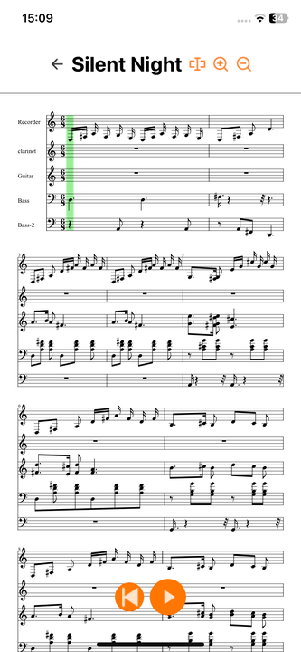

# osmd-swift

OpenSheetMusicDisplay for Swift
Currently supports:
- setting OSMDOptions via props
- loading a local or remote music xml file
- playing audio & controlling playback
- zoom in / out




## Setup
To use the osmd-swift package within your iOS app, clone this repo and in the xcode project navigator on the left right click your app project and select "Add package dependency". Then select "Add Local.." and navigate to the downloaded package and add it.

## Usage

In your ContentView.swift file add an instance of osmd():
```
let osmd = OSMD()
```
You can then create a new OSMDView to display a specified musicXML sheet:
```
osmd.OSMDView(musicXML: insertYourMusicXMLPathHere, options: ["option":value])
```
Add options if you want to get more specific. The osmd instance can be controlled using the functions:
```
osmd.play()     // start playback
osmd.pause()    // pause playback
osmd.stop()     // stop playback and reset to beginning
```
Furthermore you can adjust the cursor color:
```
osmd.setCursorColor('#f00')
```
and zoom in and out of the sheet:
```
osmd.setZoom(1.1)
```

# Example

For a simple example please see the ExampleApp contained within this repo